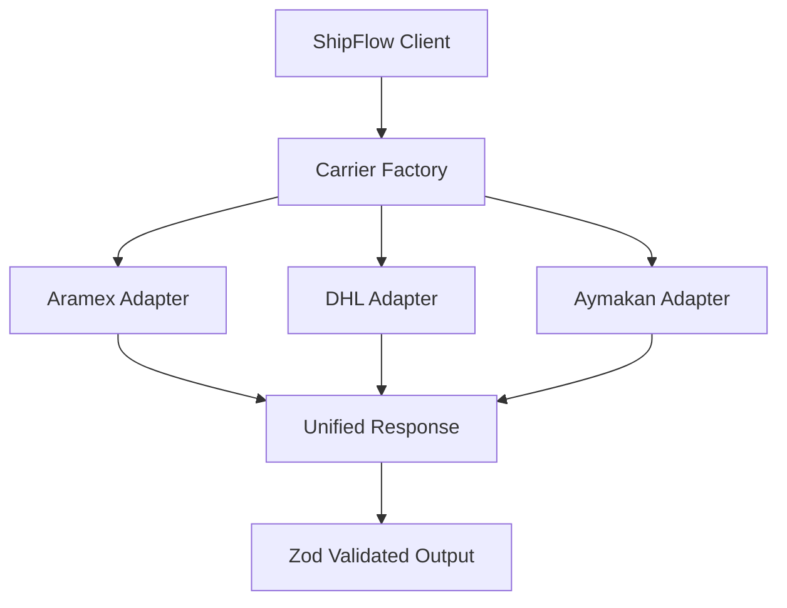

# ShipFlow - Unified Shipping Carrier SDK for Arab Region

A type-safe, Bun-native SDK providing a unified interface for shipping carriers operating in the Arab region (Saudi Arabia, Egypt, Jordan, UAE, etc.).

## Target Carriers

| Carrier | Type | Primary Markets | API Type |
|---------|------|-----------------|----------|
| **Aramex** | Global | MENA (HQ: UAE) | REST/SOAP |
| **DHL Express** | Global | Worldwide + MENA | REST (MyDHL API) |
| **Aymakan** | Regional | Saudi Arabia | REST |

---

## User Review Required

> [!IMPORTANT]
> **Carrier Priority**: Should I start with all 3 carriers or focus on a subset first?

> [!IMPORTANT]
> **API Credentials**: Do you have sandbox/production credentials for these carriers? Each requires:
> - **Aramex**: AccountNumber, Username, Password, AccountPin, AccountEntity, AccountCountryCode
> - **DHL**: API Key + Secret (MyDHL API)
> - **Aymakan**: API Key

---

## Architecture Overview



### Design Principles

1. **Adapter Pattern**: Each carrier implements a common `CarrierAdapter` interface
2. **Type Safety**: Zod schemas for all I/O with end-to-end type inference
3. **Bun Native**: Uses `fetch` (Bun optimized), no axios/node-fetch
4. **Zero Runtime Overhead**: All validation at compile-time where possible
5. **Tree-Shakeable**: Individual carrier imports for bundle optimization

---

## Proposed Changes

### Package Structure

```
shipflow/
├── src/
│   ├── index.ts                    # Main exports
│   ├── client.ts                   # ShipFlow factory
│   ├── core/
│   │   ├── types.ts                # Core interfaces
│   │   ├── schemas.ts              # Zod schemas (Address, Shipment, etc.)
│   │   ├── errors.ts               # Custom error classes
│   │   └── http.ts                 # Bun-native HTTP client
│   ├── carriers/
│   │   ├── base.ts                 # CarrierAdapter interface
│   │   ├── aramex/
│   │   │   ├── index.ts
│   │   │   ├── adapter.ts
│   │   │   ├── schemas.ts          # Aramex-specific Zod schemas
│   │   │   └── mappers.ts          # Transform to/from unified types
│   │   ├── dhl/
│   │   │   ├── index.ts
│   │   │   ├── adapter.ts
│   │   │   ├── schemas.ts
│   │   │   └── mappers.ts
│   │   └── aymakan/
│   │       ├── index.ts
│   │       ├── adapter.ts
│   │       ├── schemas.ts
│   │       └── mappers.ts
│   └── utils/
│       ├── countries.ts            # Country/region codes
│       └── weight.ts               # Unit conversions
├── tests/
│   ├── aramex.test.ts
│   ├── dhl.test.ts
│   └── aymakan.test.ts
├── package.json
└── tsconfig.json
```

---

### Core Types & Interfaces

#### [NEW] [types.ts](file:///home/shhain/Documents/projects/packages/shipflow/src/core/types.ts)

Unified types for all carriers:

```typescript
export interface CarrierConfig {
  carrier: 'aramex' | 'dhl' | 'aymakan';
  mode: 'sandbox' | 'production';
  credentials: Record<string, string>;
}

export interface Address {
  name: string;
  company?: string;
  line1: string;
  line2?: string;
  line3?: string;
  city: string;
  stateOrProvince?: string;
  postalCode?: string;
  countryCode: string; // ISO 3166-1 alpha-2
  phone: string;
  email?: string;
}

export interface Parcel {
  weight: { value: number; unit: 'kg' | 'lb' };
  dimensions?: { length: number; width: number; height: number; unit: 'cm' | 'in' };
  description?: string;
  value?: { amount: number; currency: string };
}

export interface CreateShipmentInput {
  shipper: Address;
  consignee: Address;
  parcels: Parcel[];
  serviceType?: string;
  reference?: string;
  codAmount?: { amount: number; currency: string };
  labelFormat?: 'PDF' | 'ZPL' | 'PNG';
}

export interface Shipment {
  id: string;
  carrier: string;
  trackingNumber: string;
  labelUrl?: string;
  labelData?: string; // Base64
  status: ShipmentStatus;
  estimatedDelivery?: Date;
  rate?: { amount: number; currency: string };
  rawResponse?: unknown;
}

export interface TrackingEvent {
  timestamp: Date;
  status: string;
  location?: string;
  description: string;
}

export interface TrackingResult {
  trackingNumber: string;
  carrier: string;
  status: ShipmentStatus;
  events: TrackingEvent[];
  estimatedDelivery?: Date;
}

export type ShipmentStatus = 
  | 'pending' | 'picked_up' | 'in_transit' 
  | 'out_for_delivery' | 'delivered' | 'exception' | 'returned';
```

#### [NEW] [base.ts](file:///home/shhain/Documents/projects/packages/shipflow/src/carriers/base.ts)

Carrier adapter interface:

```typescript
export interface CarrierAdapter {
  readonly name: string;
  readonly supportedCountries: string[];
  
  // Core operations
  createShipment(input: CreateShipmentInput): Promise<Shipment>;
  cancelShipment(shipmentId: string): Promise<boolean>;
  
  // Tracking
  track(trackingNumber: string): Promise<TrackingResult>;
  trackMultiple(trackingNumbers: string[]): Promise<TrackingResult[]>;
  
  // Rates (optional)
  getRates?(input: CreateShipmentInput): Promise<Rate[]>;
  
  // Pickup (optional)
  schedulePickup?(input: PickupInput): Promise<Pickup>;
  cancelPickup?(pickupId: string): Promise<boolean>;
  
  // Utilities
  validateAddress?(address: Address): Promise<AddressValidationResult>;
}
```

---

### Carrier Adapters

#### [NEW] Aramex Adapter

- **API**: REST (v1 via `ws.aramex.net`)
- **Auth**: Account credentials in request body
- **Endpoints**:
  - `POST /ShippingAPI.V2/Shipping/Service_1_0.svc/json/CreateShipments`
  - `POST /ShippingAPI.V2/Tracking/Service_1_0.svc/json/TrackShipments`
  - `POST /ShippingAPI.V2/RateCalculator/Service_1_0.svc/json/CalculateRate`

#### [NEW] DHL Express Adapter

- **API**: MyDHL API (REST)
- **Auth**: Basic Auth (API Key + Secret)
- **Endpoints**:
  - `POST /shipments` - Create shipment
  - `GET /tracking?shipmentTrackingNumber={AWB}` - Track
  - `POST /rates` - Get rates

#### [NEW] Aymakan Adapter

- **API**: REST
- **Auth**: API Key in header (`Authorization: Bearer {key}`)
- **Endpoints**:
  - `POST /v2/shipping/create` - Create shipment
  - `GET /v2/shipping/track/{tracking_number}` - Track
  - `POST /v2/shipping/cancel/{tracking_number}` - Cancel

---

### SDK Factory

#### [NEW] [client.ts](file:///home/shhain/Documents/projects/packages/shipflow/src/client.ts)

```typescript
import { AramexAdapter } from './carriers/aramex';
import { DHLAdapter } from './carriers/dhl';
import { AymakanAdapter } from './carriers/aymakan';

export function createShipFlowClient(configs: CarrierConfig[]) {
  const carriers = new Map<string, CarrierAdapter>();
  
  for (const config of configs) {
    switch (config.carrier) {
      case 'aramex':
        carriers.set('aramex', new AramexAdapter(config));
        break;
      case 'dhl':
        carriers.set('dhl', new DHLAdapter(config));
        break;
      case 'aymakan':
        carriers.set('aymakan', new AymakanAdapter(config));
        break;
    }
  }
  
  return {
    carrier: (name: string) => carriers.get(name),
    
    // Multi-carrier operations
    async getRatesFromAll(input: CreateShipmentInput) {
      const results = await Promise.allSettled(
        [...carriers.values()].map(c => c.getRates?.(input))
      );
      // ... aggregate and return
    },
    
    async trackAcrossCarriers(trackingNumber: string) {
      // Try each carrier until found
    }
  };
}
```

---

## Verification Plan

### Automated Tests

```bash
# Type checking
bun tsc --noEmit

# Unit tests (with mocks)
bun test

# Specific carrier tests
bun test tests/aramex.test.ts
bun test tests/dhl.test.ts
bun test tests/aymakan.test.ts
```

### Manual Verification

1. **Import Test**: Create a test file that imports the package and verifies IntelliSense works
2. **Sandbox Testing**: If you provide credentials, I'll test against sandbox APIs
3. **Bundle Check**: Verify tree-shaking by importing single carrier

---

## Usage Example

```typescript
import { createShipFlowClient } from 'shipflow';

const client = createShipFlowClient([
  {
    carrier: 'aramex',
    mode: 'sandbox',
    credentials: {
      accountNumber: '...',
      username: '...',
      password: '...',
      pin: '...',
    }
  },
  {
    carrier: 'aymakan',
    mode: 'production',
    credentials: { apiKey: '...' }
  }
]);

// Create shipment via Aramex
const shipment = await client.carrier('aramex').createShipment({
  shipper: { name: 'Warehouse', city: 'Riyadh', countryCode: 'SA', ... },
  consignee: { name: 'Customer', city: 'Jeddah', countryCode: 'SA', ... },
  parcels: [{ weight: { value: 1, unit: 'kg' } }]
});

console.log(shipment.trackingNumber);
```


Here is the finalized, consolidated **ShipFlow v2.0 Implementation Plan** incorporating the modular architecture, tree-shaking support, and carrier-specific optimizations.

# ShipFlow v2.0 - Modular Shipping SDK for Arab Region

A type-safe, Bun-native SDK using a **Dependency Injection** pattern. This ensures that users only bundle the code for the carriers they actually use (Tree-Shaking), while maintaining a unified interface for their application logic.

---

## 1. Architecture Overview

We are introducing a **Normalization Layer** to handle the disparity between modern REST APIs (Aymakan) and legacy JSON-wrapped SOAP APIs (Aramex).

```mermaid
graph LR
    User[User Code] --> Client[ShipFlow Client]
    Client --> Adapter[Carrier Adapter]
    
    subgraph "Internal Flow"
    Adapter --> ZodInput[Zod Validation (Input)]
    ZodInput --> HTTP[Bun HTTP Client]
    HTTP --> API[Carrier API]
    API --> HTTP
    HTTP --> RawValidator[Zod Schema (Raw Response)]
    RawValidator --> Normalizer[Data Normalizer]
    end
    
    Normalizer --> Unified[Unified Shipment Object]
    Unified --> User

```

### Design Principles

1. **Dependency Injection**: Adapters are injected into the client, not hard-coded.
2. **Logical Error Handling**: Catches "Fake 200 OK" responses (common in Aramex) that actually contain business errors.
3. **Strict Service Codes**: Uses specific Enums (e.g., `AramexService.EXPRESS`) mapped to strings, rather than vague generic unions.
4. **Bun Native**: Uses `fetch` exclusively; zero dependencies on `axios` or `node-fetch`.

---

## 2. Package Structure

```text
shipflow/
├── src/
│   ├── index.ts                    # Main exports (ShipFlow class)
│   ├── client.ts                   # The Tree-shakeable Client
│   ├── core/
│   │   ├── types.ts                # Unified interfaces
│   │   ├── http.ts                 # Bun fetch + "Logical Error" handling
│   │   └── errors.ts               # ShipFlowError, NetworkError, APIError
│   ├── carriers/
│   │   ├── base.ts                 # Base Class Interface
│   │   ├── aramex/
│   │   │   ├── index.ts            # Exports Adapter & Enums
│   │   │   ├── adapter.ts
│   │   │   ├── services.ts         # Service Codes (PP, EXP, etc.)
│   │   │   ├── normalizer.ts       # Logic to clean "SOAP-in-JSON" data
│   │   │   └── types.ts            # Raw Aramex Interfaces
│   │   └── aymakan/
│   │       ├── index.ts
│   │       ├── adapter.ts
│   │       ├── services.ts
│   │       └── normalizer.ts
│   └── utils/
│       └── datetime.ts             # Helper for Aramex /Date(123)/ formats
├── tests/
│   ├── aramex.test.ts
│   └── aymakan.test.ts

```

---

## 3. Core Interfaces

### Unified Types (`src/core/types.ts`)

We added an `options` object to handle carrier-specific edge cases (like incoterms or customs flags) without polluting the main interface.

```typescript
export interface ShipmentOptions {
  /** DHL: Is this shipment dutiable? */
  customsDeclarable?: boolean;
  /** Global: Delivery Duty Paid (DDP) vs Unpaid (DAP) */
  incoterms?: 'DDP' | 'DAP';
  /** Aramex: Description of Goods (Separate from generic desc) */
  goodsDescription?: string;
  /** Carrier specific metadata to pass through blind */
  metadata?: Record<string, any>;
}

export interface CreateShipmentInput {
  shipper: Address;
  consignee: Address;
  parcels: Parcel[];
  
  /** * The carrier-specific service code. 
   * Use the exported enums (e.g., AramexService.EXPRESS_PARCEL)
   */
  serviceType: string; 
  
  reference?: string;
  codAmount?: { amount: number; currency: string };
  labelFormat?: 'PDF' | 'ZPL' | 'PNG';
  
  /** Handles edge cases per carrier */
  options?: ShipmentOptions; 
}

export interface TrackingResult {
  trackingNumber: string;
  carrier: string;
  status: ShipmentStatus; // 'delivered', 'in_transit', etc.
  events: TrackingEvent[];
  /** The raw response from the carrier, for debugging */
  raw?: unknown; 
}

```

### Carrier Adapter Interface (`src/carriers/base.ts`)

```typescript
export interface CarrierAdapter {
  readonly name: string;
  readonly supportedCountries: string[];

  createShipment(input: CreateShipmentInput): Promise<Shipment>;
  track(trackingNumber: string): Promise<TrackingResult>;
  // Optional methods
  getRates?(input: CreateShipmentInput): Promise<Rate[]>;
  cancelShipment?(id: string): Promise<boolean>;
}

```

---

## 4. The Tree-Shakeable Client (`src/client.ts`)

This factory allows the end-user to control their bundle size.

```typescript
import type { CarrierAdapter } from './carriers/base';

export class ShipFlow {
  private adapters = new Map<string, CarrierAdapter>();

  constructor(options: { adapters: CarrierAdapter[] }) {
    options.adapters.forEach(adapter => {
      this.adapters.set(adapter.name, adapter);
    });
  }

  public carrier(name: string): CarrierAdapter {
    const adapter = this.adapters.get(name);
    if (!adapter) throw new Error(`Carrier ${name} not configured`);
    return adapter;
  }
}

```

---

## 5. Carrier Implementation Strategy

### Priority 1: Aramex (The Complex One)

* **Target:** `ws.aramex.net/ShippingAPI.V2`
* **Challenges:**
* Auth is sent in the *body* (`ClientInfo`), not headers.
* Dates are often returned as `/Date(1678888)/` strings.
* Errors often return `200 OK` with `HasErrors: true`.


* **Solution:**
* `normalizer.ts` will house a regex date parser.
* `http.ts` will implement a middleware check: `if (json.HasErrors) throw new ShipFlowAPIError(...)`.


### Priority 2: Aymakan (The Standard One)

* **Target:** `api.aymakan.com.sa/v2`
* **Challenges:** Strict validation on phone numbers (must often be SA format `966...`).
* **Solution:** Use strictly typed Zod schemas for the Aymakan adapter input to catch phone format errors before sending the request.

---

## 6. Implementation Roadmap

| Phase | Task | Description |
| --- | --- | --- |
| **1** | **Core** | Setup Bun project, implement `http.ts` wrapper, define base types. |
| **2** | **Aramex** | Implement `AramexAdapter`, `AramexService` enums, and SOAP-JSON normalization. |
| **3** | **Aymakan** | Implement `AymakanAdapter` and standard REST normalization. |
| **4** | **Testing** | Write unit tests using mocked `fetch` responses for both carriers. |

---

## 7. Final Usage Example

```typescript
import { ShipFlow } from 'shipflow';
import { AramexAdapter, AramexService } from 'shipflow/carriers/aramex';

// 1. Initialize Adapter (Modular)
const aramex = new AramexAdapter({
  mode: 'sandbox',
  credentials: {
    username: 'user@example.com',
    password: '...',
    accountNumber: '...',
    accountPin: '...',
    accountEntity: 'AMM',
    accountCountryCode: 'JO'
  }
});

// 2. Inject into Client
const client = new ShipFlow({
  adapters: [aramex] // Aymakan code is NOT bundled here
});

// 3. Execute
const shipment = await client.carrier('aramex').createShipment({
  shipper: { name: 'Store', city: 'Riyadh', countryCode: 'SA', ... },
  consignee: { name: 'Ali', city: 'Jeddah', countryCode: 'SA', ... },
  parcels: [{ weight: { value: 1, unit: 'kg' } }],
  
  // Type-safe Service Selection
  serviceType: AramexService.EXPRESS_PARCEL, 
  
  options: {
    goodsDescription: 'Mobile Accessories'
  }
});

```